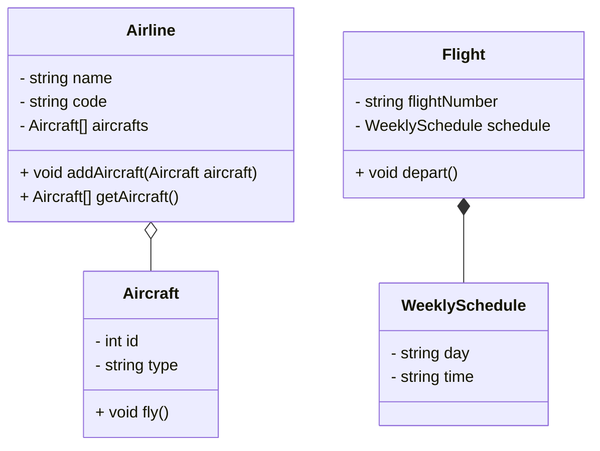

# Aggregation vs Composition

```mermaid
classDiagram
    class Airline {
        - string name
        - string code
        - Aircraft[] aircrafts
        + void addAircraft(Aircraft aircraft)
        + Aircraft[] getAircraft()
    }
    class Aircraft {
        - int id
        - string type
        + void fly()
    }
    
    Airline o-- Aircraft

    class Flight {
        - string flightNumber
        - WeeklySchedule schedule
        + void depart()
    }
    class WeeklySchedule {
        - string day
        - string time
    }
    Flight *-- WeeklySchedule
    

```