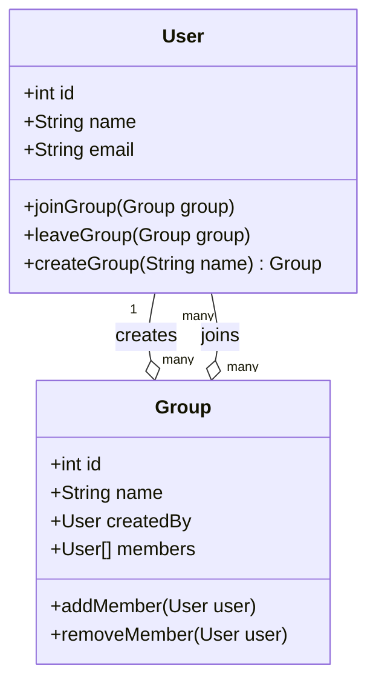
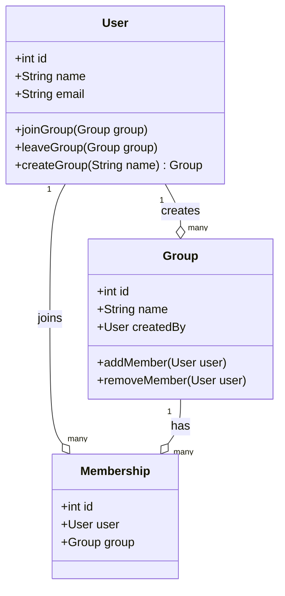
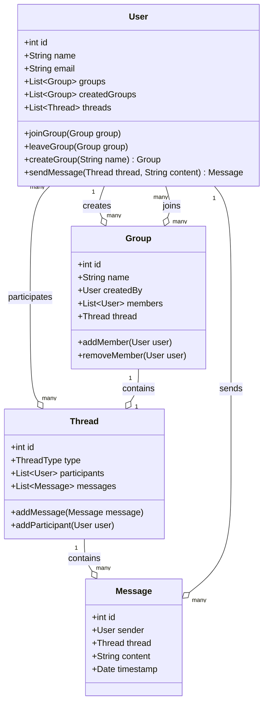

# User, Group
- User can create group, join group, leave group
- Group has one owner, many members

## Approach 1

```mermaid
classDiagram
    class User {
        +int id
        +String name
        +String email
        +joinGroup(Group group)
        +leaveGroup(Group group)
        +createGroup(String name) Group
    }

    class Group {
        +int id
        +String name
        +User createdBy
        +User[] members
        +addMember(User user)
        +removeMember(User user)
    }

    User "1" --o "many" Group : creates
    User "many" --o "many" Group : joins

```

## Approach 2

```mermaid
classDiagram
    class User {
        +int id
        +String name
        +String email
        +joinGroup(Group group)
        +leaveGroup(Group group)
        +createGroup(String name) Group
    }

    class Group {
        +int id
        +String name
        +User createdBy
        +addMember(User user)
        +removeMember(User user)
    }

    class Membership {
        +int id
        +User user
        +Group group
    }

    User "1" --o "many" Membership : joins
    Group "1" --o "many" Membership : has
    User "1" --o "many" Group : creates

```

# User / Messages

```mermaid
classDiagram
    class User {
        +int id
        +String name
        +String email
        +List~Group~ groups
        +List~Group~ createdGroups
        +List~Thread~ threads
        +joinGroup(Group group)
        +leaveGroup(Group group)
        +createGroup(String name) Group
        +sendMessage(Thread thread, String content) Message
    }

    class Group {
        +int id
        +String name
        +User createdBy
        +List~User~ members
        +Thread thread
        +addMember(User user)
        +removeMember(User user)
    }

    class Thread {
        +int id
        +ThreadType type
        +List~User~ participants
        +List~Message~ messages
        +addMessage(Message message)
        +addParticipant(User user)
    }

    class Message {
        +int id
        +User sender
        +Thread thread
        +String content
        +Date timestamp
    }

    User "1" --o "many" Group : creates
    User "many" --o "many" Group : joins
    User "many" --o "many" Thread : participates
    Group "1" --o "1" Thread : contains
    Thread "1" --o "many" Message : contains
    User "1" --o "many" Message : sends

```